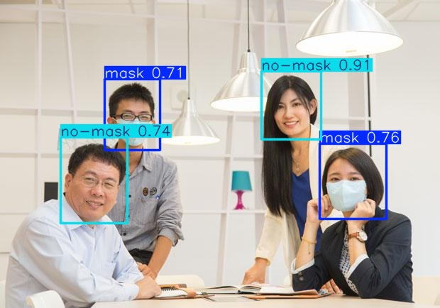

# 🎯 Face Mask Detection Using YOLOv8

This project implements a **real-time face mask detection system** using the **YOLOv8 object detection model** developed by Ultralytics. The trained model can identify whether individuals in images or videos are wearing face masks properly, improperly, or not at all.

---

## 📌 Table of Contents

- [Overview](#overview)
- [Features](#features)
- [Requirements](#requirements)
- [Dataset](#dataset)
- [Training](#training)
- [Evaluation](#evaluation)
- [Inference](#inference)
- [Results](#results)
- [License](#license)

---

## 🔍 Overview

With the rise of public health concerns, ensuring proper mask usage has become critical. This project leverages the power of **YOLOv8**, a state-of-the-art real-time object detection framework, to detect and classify faces into three categories:

- With mask
- Without mask
- Mask worn incorrectly (e.g., below nose)

The model is trained on a custom dataset and can be used for both image and video inference.

---

## ✨ Features

- Fast and accurate object detection using YOLOv8
- Supports training, validation, and inference pipelines
- Customizable confidence threshold
- Easy-to-use command-line interface for predictions
- Visualization of bounding boxes and class labels

---

## 🧰 Requirements

To run this project, ensure you have the following installed:

- Python 3.8+
- PyTorch 1.13+
- Ultralytics YOLOv8 (`pip install ultralytics`)
- OpenCV (`pip install opencv-python`)
- Matplotlib (`pip install matplotlib`)

Optional (for Jupyter Notebook usage):

- Jupyter Notebook / Lab
- IPython

You can install dependencies using:

```bash
pip install -r requirements.txt
```

## 📈 Sample Results

### Input image


### Output image



Sample outputs show detected faces with bounding boxes and class labels indicating mask status.

---

## 📦 License

This project is licensed under the MIT License.
